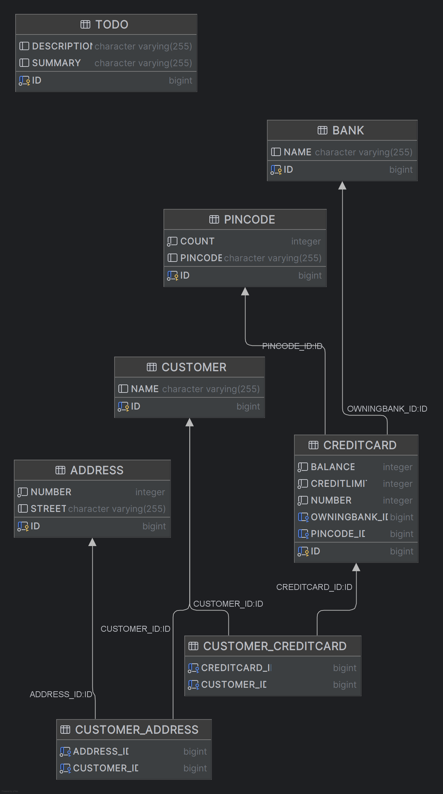
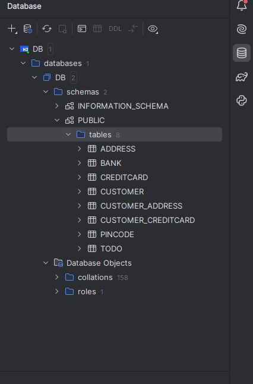

# Expass 2

### Explain the used database and how/when it runs.
The given database contains 5 tables with relations. The tables Address and Customer have a
bidirectional many-to-many relationship. The tables Customer and CreditCard have a unidirectional
many-to-many relationship where the CreditCards belong to the customers. The tables CreditCard and Pincode
have a unidirectional one-to-many relationship where multiple CreditCards can have the same Pincode.
The tables CreditCard and Bank have a bidirectional relationship where each bank can have multiple 
credit cards.

The main() method when run creates the entitymanager that handles transactions, and creates the database
based on the classes specified in the persistence.xml and their contents. The relations between tables is
specified in the classes themselves. When objects in the entitymanager are persisted and the entitymanagers commits,
the objects get added to the database.

### Can you provide the SQL used to create the table Customer?
```sql
create table Customer (
    id bigint generated by default as identity,
    name varchar(255),
    primary key (id)
) 
```

### Find a way to inspect the database tables being created and create a database schema in your report. Do the created tables correspond to your initial thoughts regarding the exercise?
On IntelleJ Ultimate you can use the db file generated by the program as a
data source on the Database page from the right side menu in the IDE. The created tables correspond well with what I
initially thought about the exercise and the given diagram.



## Technical problems
I did not encounter any technical problems during installation. The project worked well when forked.
The biggest problem I had was that I forgot to add the classes to the persistence.xml file, which gave
an error that was hard to decode the meaning of. I also had some problems with getting the correct collection
type, as the errors showed that the objects themselves were correct, but were contained in different types of collections,
which gave an assertion error. I fixed this by casting the returned object in the Bank.getOwnedCards() and the 
Address.getOwners() method to a HashSet.

## Link to code
[Link](src/main/java/no/hvl/dat250/jpa/tutorial/creditcards)

## Inspecting database tables
I inspected the database tables through the IntelleJ Ultimate IDE as explained earlier.
It created these tables:  These are the tables specified in the given diagram,
plus join tables for the many-to-many relationships.

## Pending issues
There are no pending issues that I am aware of.

